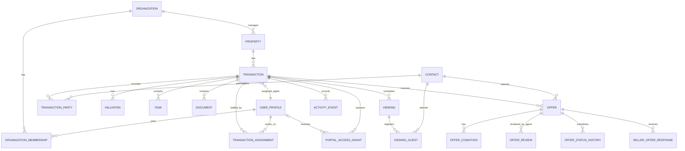

# Mó — Product V1

## 1. Product concept

Mó is an Icelandic real-estate operating system centered on a single property transaction.

The product connects three experiences:

- an operational workspace for licensed real-estate agents;
- a calm seller portal focused on progress, interest, and required actions;
- a transactional buyer portal for property information, offers, and offer status.

The property and its transaction are the primary organizing objects. Tasks, viewings, documents, buyers, offers, communication, and portal access belong to that transaction.

V1 begins before public listing, with seller onboarding and valuation, and continues through preparation, marketing, viewings, offers, contract work, closing, and handover.

The licensed agent remains in control of regulated transaction steps. Customer actions in the current prototype represent information, requests, or workflow intent. They do not independently create a legally binding transaction.

V1 currently uses hardcoded data and browser-local mock state. There is no backend, authentication, database, legal submission, or electronic signature.

In V1, one `organization` represents one real-estate agency/company. Offices, branches, and organization hierarchies are intentionally not modeled yet.

## 2. User roles

### Agent

A licensed real-estate professional who:

- creates and manages property transactions;
- onboards sellers and records valuations;
- prepares listings and required documents;
- manages viewings and buyer follow-up;
- reviews buyer-submitted offers;
- decides when an offer is ready to share with a seller;
- coordinates the formal process outside the current prototype.

### Seller

An owner associated with a property transaction who can:

- see the customer-safe transaction stage;
- see aggregated listing and viewing interest;
- understand what the agent has done and what happens next;
- access seller-visible documents;
- review an agent-approved offer;
- communicate workflow intent to the agent.

The seller cannot see internal CRM notes, identifiable viewing feedback, or other internal review data.

### Buyer

A prospective buyer associated with a property who can:

- view property information and buyer-visible documents;
- see their own buyer journey;
- prepare and submit an offer for agent review;
- see the status of their own offer;
- communicate with the responsible agent.

The buyer cannot see the seller's private information, competing buyers, competing offers, or internal agent notes.

### Team member / administrator

A future internal role for organization membership, assignments, permissions, and configuration. The V1 interface contains team and settings navigation placeholders, but these capabilities are not implemented.

## 3. Property lifecycle

The canonical internal lifecycle is:

1. **Verðmat** — seller relationship and valuation begin.
2. **Undirbúningur** — documents, photography, listing copy, and approvals are prepared.
3. **Á sölu** — the property is publicly listed.
4. **Skoðanir** — viewings and buyer follow-up are active.
5. **Tilboð** — one or more offers are being reviewed or handled.
6. **Samningur** — contract work follows an accepted offer.
7. **Frágangur** — closing preparation and outstanding items are handled.
8. **Afhending** — the property is handed over.
9. **Lokið** — the transaction is complete.

The current Laugavegur 120 workspace remains at **Skoðanir** when an offer first arrives. An offer can be active without prematurely advancing the entire transaction to **Tilboð**. Stage changes should be deliberate agent-controlled actions.

Customer-facing lifecycles are simplified:

- sellers see preparation through handover in plain language;
- buyers see only their journey: viewing, interest, offer, accepted offer, contract, and handover.

## 4. V1 screens

### Internal agent screens

| Route | Screen | Purpose |
| --- | --- | --- |
| `/` | Dashboard | Today's viewings, work requiring attention, and active properties. |
| `/properties` | Property index | Searchable, filterable overview of all property transactions. |
| `/properties/new` | New property flow | Seller onboarding, property details, valuation, preparation, and review. |
| `/properties/laugavegur-120` | Property workspace | Central operational workspace for one property transaction. |
| `/properties/laugavegur-120/viewings/open-house-2026-10-02` | Viewing management | Attendance, interest, notes, walk-ins, and post-viewing follow-up. |
| `/properties/laugavegur-120/offers/1042` | Agent offer review | Review, request changes, reject a draft, approve for seller review, and send to seller. |

### Seller screens

| Route | Screen | Purpose |
| --- | --- | --- |
| `/seller/laugavegur-120` | Seller portal | Progress, aggregated interest, agent activity, documents, and next steps. |
| `/seller/laugavegur-120/offers/1042` | Seller offer view | Customer-safe offer summary and non-binding seller workflow intent. |

### Buyer screens

| Route | Screen | Purpose |
| --- | --- | --- |
| `/buyer/laugavegur-120` | Buyer portal | Property information, documents, buyer journey, and own-offer status. |
| `/buyer/laugavegur-120/offer` | Offer flow | Four-step offer preparation, conditions, buyer details, review, and mock submission. |

Some earlier placeholder routes remain in the prototype. The routes above are the canonical V1 flows.

## 5. V1 workflows

### Property and seller onboarding

1. Agent starts a new property transaction.
2. Agent records the seller and optional additional owner.
3. Agent records or mock-fetches property registry information.
4. Agent records valuation assumptions and commission.
5. Agent configures preparation tasks.
6. Agent reviews and creates the property in **Undirbúningur**.
7. Outstanding preparation work appears in the property workspace.

### Viewing management

1. Registered buyers appear in the viewing guest list.
2. Agent records attendance during the viewing.
3. Agent can add walk-in guests.
4. Agent records interest, private notes, and follow-up actions.
5. Agent reviews the aggregate viewing summary.
6. Agent completes the viewing and prepares a seller-safe update.
7. Only aggregate attendance, interest counts, anonymized feedback, and an agent-written summary may reach the seller portal.

### Buyer offer submission

1. Buyer enters amount, validity, and requested handover.
2. Buyer selects conditions and financing status.
3. Buyer reviews prefilled identity and contact information.
4. Buyer reviews the full offer summary.
5. Buyer submits a prototype offer to the responsible agent.
6. Buyer sees **Í yfirferð hjá fasteignasala**.

Submission does not bypass the licensed agent and does not constitute electronic signature or legal submission.

### Agent offer review

1. Submitted offer enters **Bíður yfirferðar**.
2. Agent reviews identity, contact information, validity, handover, conditions, and financing status.
3. Agent may request a change or reject the draft.
4. Agent may mark the offer **Tilbúið fyrir seljanda**.
5. A separate action sends the customer-safe offer summary to the seller.
6. The offer becomes **Sent seljanda**.

### Seller offer response

1. Seller sees an offer only after the agent sends it.
2. Seller reviews amount, difference from asking price, validity, handover, and conditions.
3. Seller can express intent to accept, reject, or discuss a counter-offer.
4. The intent is sent to the agent.
5. The agent continues the formal process outside the current prototype.

### Buyer status updates

1. Buyer sees when the offer was submitted.
2. Buyer sees when the agent reviewed it.
3. Buyer sees when it was sent to the seller.
4. Buyer is told when no action is currently required.

## 6. Core entities

### Organization

The real-estate agency using Mó. Owns internal users, properties, transactions, and operational data.

### User profile

Application identity connected to an authentication user. May participate as an internal team member, seller, buyer, or more than one role in different transactions.

### Organization membership

Connects an internal user to an organization and defines organization-level role and status.

### Contact

A person or legal party known to the organization. Stores the minimum contact information needed for sellers, viewing prospects, offer makers, and representatives. Production V1 does not persist kennitala or another national identifier.

### Property

The physical real-estate asset: address, municipality, registry number, size, rooms, year, and other stable attributes.

### Transaction

The current sale process for a property. Holds lifecycle stage, responsible agent, asking price, and operational state. A property may have multiple transactions over time.

### Transaction assignment

Associates internal users with a transaction as `primary_agent`, `co_agent`, or `coordinator`. `transactions.assigned_agent_id` may remain as the convenient primary/responsible-agent reference, but the assignment table is the source for the wider working team.

### Transaction party

Associates formal parties with a transaction. In V1 this is primarily the seller, co-owner, or representative. Prospective buyers are not transaction parties: viewing prospects remain `contacts` plus `viewing_guests`, and offer makers remain `contacts` plus `offers`. A buyer may become a formal transaction party only after an offer is accepted in a later workflow.

### Valuation

Estimated market value, proposed asking price, commission, notes, completion state, and responsible agent.

### Task

Operational work belonging to a transaction, such as obtaining the property registry record, photography, seller approval, or follow-up.

### Document

Metadata and storage reference for a transaction document, with an explicit audience classification.

### Viewing

A scheduled property viewing with date, time, type, status, and aggregate completion data.

### Viewing guest

A buyer/contact registered for a viewing. Holds attendance, interest, internal notes, and next action.

### Offer

A buyer's proposed amount, validity, handover, conditions, submission state, agent review state, and seller-sharing state.

### Offer condition

A structured condition attached to an offer, such as financing, sale of another property, or further inspection.

### Offer review

Internal agent review data, including checklist results, change requests, reviewer, and timestamps.

### Seller offer response

An immutable, append-only record of the seller's non-binding workflow intent: accept, reject, or discuss a counter-offer. A later intent creates another response row; it never overwrites an earlier response.

### Offer status history

An immutable, append-only record of every offer status transition, including actor, reason, and timestamp.

### Activity event

An immutable timeline item describing something that happened in a transaction. Every event has an audience classification.

### Portal access grant

Grants a specific authenticated customer access to a specific transaction as seller or buyer.

## 7. Relationships between entities

Important modeling decisions:

- `property` describes the physical asset; `transaction` describes one sale process.
- `transactions.assigned_agent_id` identifies the primary responsible agent, while `transaction_assignments` represents the complete internal working team;
- customer access is scoped to a transaction, not granted broadly to an organization;
- a contact record and an authenticated user profile are separate so invitations can occur later;
- prospective buyers do not become `transaction_parties` merely by registering for a viewing or submitting an offer;
- viewing notes and offer-review notes are internal records, not fields on customer-visible entities;
- lifecycle history, offer status history, and seller offer responses are append-only records rather than overwritten audit data.

## 8. Important business rules

1. A transaction has one current lifecycle stage and an immutable stage history.
2. A newly created transaction begins in `valuation` or `preparation`, never directly in a public listing state.
3. Only an authorized internal agent can advance the canonical transaction stage.
4. An incoming offer does not automatically move the transaction from `viewings` to `offers`.
5. A buyer submission always enters agent review first.
6. A buyer cannot set agent-review, seller-sharing, acceptance, or rejection states.
7. Agent approval for seller review is not seller acceptance.
8. Sending an offer to a seller requires a separate, explicit agent action.
9. Seller response buttons record workflow intent only; they do not complete a legally binding acceptance.
10. Offer validity must be stored as an absolute timestamp with timezone, not display text such as “today at 20:00.”
11. Monetary values must be stored as integer ISK amounts. Formatting belongs in the application layer.
12. Percentages such as commission should be stored as fixed-precision numeric values.
13. Viewing interest is recorded per guest, but seller reporting is aggregated and anonymized.
14. Walk-in guests become transaction contacts only under an explicit data-retention policy.
15. Every customer-visible update must declare its audience explicitly.
16. Internal notes never become customer-visible merely because they belong to the same transaction.
17. Documents require an explicit visibility classification before portal access is possible.
18. Deletion of offers, reviews, stage transitions, and seller responses should normally be replaced by cancellation or supersession records for auditability.
19. All timestamps should be stored in UTC and displayed in the relevant Icelandic locale/timezone.
20. Production V1 does not persist kennitala. Identity assurance, regulated forms, and legal wording require a later dedicated implementation and professional review.
21. Viewing registration or offer submission does not make a prospective buyer a formal transaction party.
22. Every offer status change creates an `offer_status_history` row; history rows are never updated or deleted through normal application workflows.
23. Every seller intent creates a new `seller_offer_responses` row; an earlier seller intent is never overwritten.
24. `assigned_agent_id` and the `primary_agent` transaction assignment must remain consistent through a guarded database function.
25. Tenant-sensitive rows carry explicit `organization_id` where it materially simplifies RLS and tenant isolation.

## 9. Seller and buyer privacy rules

### Seller-visible information

Sellers may see:

- their own property and transaction;
- the customer-safe lifecycle stage;
- listing views and aggregate viewing attendance;
- aggregate interest counts;
- anonymized feedback themes;
- agent-written summaries and customer-visible activity;
- seller-visible documents and tasks;
- offers explicitly reviewed and sent by an agent.

Sellers must not see:

- viewing guest names or contact details by default;
- raw buyer notes or CRM notes;
- agent review comments and checklists;
- buyer financing documents unless explicitly required, approved, and legally appropriate;
- competing activity unrelated to the seller's transaction;
- internal tasks, audit metadata, or organization-only documents.

### Buyer-visible information

Buyers may see:

- the property information made available to them;
- buyer-visible documents;
- their own viewing/interest journey;
- their own submitted offers, conditions, and status history;
- customer-safe agent updates and requests for changes.

Buyers must not see:

- seller contact or identity data beyond information explicitly approved for disclosure;
- other buyer identities;
- competing offer amounts or terms;
- other buyers' viewing feedback;
- internal agent notes, seller communications, review checklists, or valuation notes;
- seller response details before the agent deliberately communicates them.

### Privacy implementation principle

Customer portals should query purpose-built safe views or RPC responses. They should not receive broad base-table rows and rely on the frontend to hide sensitive columns.

## 10. Features explicitly deferred to later

The following are outside Product V1:

- Supabase integration and production persistence;
- authentication, invitations, password management, and multi-factor authentication;
- kennitala collection, persistence, validation, or regulated identity verification;
- electronic signatures;
- legally binding offer submission or acceptance;
- contract generation and execution;
- deeds and title-transfer workflows;
- settlement and closing statements;
- accounting, invoicing, commission settlement, or payouts;
- electronic registration with public registries;
- live property-registry integration;
- automated listing publication to external property portals;
- real email, SMS, push, or in-app messaging;
- secure document upload, malware scanning, and retention automation;
- buyer financing verification or bank integrations;
- counter-offer mechanics beyond workflow intent;
- accepted/rejected offer automation;
- advanced reporting, forecasting, and brokerage analytics;
- calendar synchronization;
- configurable workflow templates;
- offices, branches, regions, and multi-office organization hierarchies;
- production audit exports and compliance tooling.

## 11. Proposed Supabase schema

This is a proposal only. No Supabase implementation should begin until naming, retention, audit, and legal requirements are reviewed.

### Proposed enums

| Enum | Values |
| --- | --- |
| `organization_role` | `admin`, `agent`, `coordinator`, `viewer` |
| `transaction_assignment_role` | `primary_agent`, `co_agent`, `coordinator` |
| `transaction_stage` | `valuation`, `preparation`, `listed`, `viewings`, `offers`, `contract`, `closing`, `handover`, `completed`, `cancelled` |
| `party_role` | `seller`, `co_owner`, `representative`, `accepted_buyer` |
| `portal_role` | `seller`, `buyer` |
| `task_status` | `not_started`, `in_progress`, `completed`, `cancelled` |
| `document_visibility` | `internal`, `seller`, `buyer`, `shared` |
| `viewing_status` | `scheduled`, `active`, `completed`, `cancelled` |
| `attendance_status` | `registered`, `attended`, `no_show` |
| `interest_level` | `very_interested`, `interested`, `unsure`, `not_interested`, `unset` |
| `offer_status` | `draft`, `submitted`, `change_requested`, `agent_approved`, `sent_to_seller`, `seller_intent_recorded`, `withdrawn`, `expired`, `superseded` |
| `seller_intent` | `accept`, `reject`, `counter_offer` |
| `activity_visibility` | `internal`, `seller`, `buyer`, `seller_and_buyer` |

### Tables

#### `organizations`

- `id uuid primary key`
- `name text`
- `created_at timestamptz`

One organization represents one real-estate agency/company in V1. Do not add office or branch tables yet.

#### `profiles`

- `id uuid primary key references auth.users(id)`
- `display_name text`
- `phone text`
- `created_at timestamptz`
- `updated_at timestamptz`

Do not store one global role on `profiles`; roles are contextual.

#### `organization_memberships`

- `organization_id uuid references organizations(id)`
- `user_id uuid references profiles(id)`
- `role organization_role`
- `is_active boolean`
- `created_at timestamptz`
- primary key: `(organization_id, user_id)`

#### `contacts`

- `id uuid primary key`
- `organization_id uuid references organizations(id)`
- `full_name text`
- `phone text`
- `email citext`
- `created_by uuid references profiles(id)`
- `created_at timestamptz`
- `updated_at timestamptz`

Production V1 deliberately does not persist kennitala or another national identifier. Fake kennitala values may remain in prototype UI fixtures only.

#### `properties`

- `id uuid primary key`
- `organization_id uuid references organizations(id)`
- `address_line text`
- `postal_code text`
- `municipality text`
- `registry_number text`
- `size_sqm numeric(10,2)`
- `room_count numeric(4,1)`
- `bedroom_count integer`
- `year_built integer`
- `created_at timestamptz`
- `updated_at timestamptz`

#### `transactions`

- `id uuid primary key`
- `organization_id uuid references organizations(id)`
- `property_id uuid references properties(id)`
- `assigned_agent_id uuid references profiles(id)`
- `stage transaction_stage`
- `asking_price_isk bigint`
- `created_by uuid references profiles(id)`
- `started_at timestamptz`
- `completed_at timestamptz null`
- `created_at timestamptz`
- `updated_at timestamptz`

`assigned_agent_id` is the denormalized primary/responsible agent for common reads. Changes to it must be synchronized with a `primary_agent` row in `transaction_assignments` by a guarded function.

#### `transaction_assignments`

- `organization_id uuid references organizations(id)`
- `transaction_id uuid references transactions(id)`
- `user_id uuid references profiles(id)`
- `role transaction_assignment_role`
- `created_at timestamptz`
- primary key or unique constraint on `(transaction_id, user_id, role)`

A transaction must have exactly one `primary_agent` assignment in V1. It may have multiple co-agents and coordinators.

#### `transaction_stage_history`

- `id uuid primary key`
- `organization_id uuid references organizations(id)`
- `transaction_id uuid references transactions(id)`
- `from_stage transaction_stage null`
- `to_stage transaction_stage`
- `changed_by uuid references profiles(id)`
- `reason text null`
- `created_at timestamptz`

#### `transaction_parties`

- `id uuid primary key`
- `organization_id uuid references organizations(id)`
- `transaction_id uuid references transactions(id)`
- `contact_id uuid references contacts(id)`
- `role party_role`
- `is_primary boolean`
- `created_at timestamptz`
- unique where appropriate on `(transaction_id, contact_id, role)`

V1 uses this table primarily for sellers, co-owners, and representatives. Do not add every viewing prospect or offer maker. Viewing prospects are modeled through `viewing_guests`; offer makers are modeled through `offers`. `accepted_buyer` is reserved for an explicit future transition after offer acceptance.

#### `portal_access_grants`

- `id uuid primary key`
- `organization_id uuid references organizations(id)`
- `transaction_id uuid references transactions(id)`
- `user_id uuid references profiles(id)`
- `contact_id uuid references contacts(id)`
- `role portal_role`
- `status text` such as `invited`, `active`, `revoked`
- `created_at timestamptz`
- `revoked_at timestamptz null`

#### `valuations`

- `id uuid primary key`
- `organization_id uuid references organizations(id)`
- `transaction_id uuid references transactions(id)`
- `performed_by uuid references profiles(id)`
- `estimated_market_value_isk bigint`
- `proposed_asking_price_isk bigint`
- `commission_percent numeric(5,2)`
- `notes text`
- `is_completed boolean`
- `performed_at timestamptz null`
- `created_at timestamptz`

#### `tasks`

- `id uuid primary key`
- `organization_id uuid references organizations(id)`
- `transaction_id uuid references transactions(id)`
- `assigned_to uuid references profiles(id) null`
- `created_by uuid references profiles(id)`
- `title text`
- `status task_status`
- `due_at timestamptz null`
- `visibility activity_visibility default 'internal'`
- `created_at timestamptz`
- `completed_at timestamptz null`

#### `documents`

- `id uuid primary key`
- `organization_id uuid references organizations(id)`
- `transaction_id uuid references transactions(id)`
- `storage_path text`
- `title text`
- `document_type text`
- `visibility document_visibility`
- `created_by uuid references profiles(id)`
- `created_at timestamptz`

File contents should live in a private Supabase Storage bucket. Database rows hold metadata and policy context.

#### `viewings`

- `id uuid primary key`
- `organization_id uuid references organizations(id)`
- `transaction_id uuid references transactions(id)`
- `viewing_type text`
- `starts_at timestamptz`
- `ends_at timestamptz`
- `status viewing_status`
- `created_by uuid references profiles(id)`
- `completed_at timestamptz null`
- `created_at timestamptz`

#### `viewing_guests`

- `id uuid primary key`
- `organization_id uuid references organizations(id)`
- `viewing_id uuid references viewings(id)`
- `contact_id uuid references contacts(id)`
- `attendance attendance_status`
- `interest interest_level`
- `internal_notes text`
- `next_action text null`
- `follow_up_due_at timestamptz null`
- `is_walk_in boolean`
- `created_at timestamptz`
- `updated_at timestamptz`

#### `offers`

- `id uuid primary key`
- `organization_id uuid references organizations(id)`
- `transaction_id uuid references transactions(id)`
- `buyer_contact_id uuid references contacts(id)`
- `buyer_user_id uuid references profiles(id) null`
- `amount_isk bigint`
- `valid_until timestamptz`
- `requested_handover_date date`
- `status offer_status`
- `created_by uuid references profiles(id)`
- `submitted_at timestamptz null`
- `agent_approved_at timestamptz null`
- `sent_to_seller_at timestamptz null`
- `created_at timestamptz`
- `updated_at timestamptz`

#### `offer_conditions`

- `id uuid primary key`
- `organization_id uuid references organizations(id)`
- `offer_id uuid references offers(id)`
- `condition_type text`
- `status text null`
- `details text null`
- `created_at timestamptz`

#### `offer_reviews`

- `id uuid primary key`
- `organization_id uuid references organizations(id)`
- `offer_id uuid references offers(id)`
- `reviewed_by uuid references profiles(id)`
- `buyer_identified boolean`
- `contact_confirmed boolean`
- `financing_needs_confirmation boolean`
- `validity_recorded boolean`
- `handover_recorded boolean`
- `internal_notes text`
- `change_request text null`
- `reviewed_at timestamptz null`
- `created_at timestamptz`

`buyer_identified` is only a prototype operational checklist result. It does not represent regulated identity verification and must not depend on a persisted kennitala in V1.

#### `offer_status_history`

- `id uuid primary key`
- `organization_id uuid references organizations(id)`
- `offer_id uuid references offers(id)`
- `from_status offer_status null`
- `to_status offer_status`
- `changed_by uuid references profiles(id) null`
- `reason text null`
- `created_at timestamptz`

This table is immutable and append-only. `changed_by` is nullable only for an explicitly system-generated transition such as expiry. Normal application roles receive no update or delete policy on this table.

#### `seller_offer_responses`

- `id uuid primary key`
- `organization_id uuid references organizations(id)`
- `offer_id uuid references offers(id)`
- `seller_contact_id uuid references contacts(id)`
- `intent seller_intent`
- `submitted_by uuid references profiles(id)`
- `submitted_at timestamptz`

This table is immutable and append-only. A seller changing their intent inserts another row. Agent acknowledgement, if later required, should be a separate activity event rather than an update to the historical response.

#### `activity_events`

- `id uuid primary key`
- `organization_id uuid references organizations(id)`
- `transaction_id uuid references transactions(id)`
- `actor_user_id uuid references profiles(id) null`
- `event_type text`
- `visibility activity_visibility`
- `summary text`
- `metadata jsonb default '{}'`
- `created_at timestamptz`

Avoid placing secrets or unrestricted personal data in `metadata`.

### Explicit tenant scoping

Tenant-sensitive operational tables carry `organization_id` even when the organization could be reached through `transaction_id`, `viewing_id`, or `offer_id`. This is intentional: it makes RLS predicates, tenant indexes, operational queries, and incident analysis more direct.

The database must prevent inconsistent tenant references. Prefer composite foreign keys or guarded insert functions that verify parent and child rows share the same `organization_id`. Client-provided organization IDs must never be trusted without that check.

### Recommended transactional functions

State transitions should use database functions rather than unrelated client updates:

- `create_property_transaction(...)`
- `set_transaction_assignment(transaction_id, user_id, role)`
- `complete_viewing(viewing_id, seller_summary)`
- `submit_offer(offer_id)`
- `request_offer_change(offer_id, reason)`
- `approve_offer_for_seller(offer_id)`
- `send_offer_to_seller(offer_id)`
- `record_seller_offer_intent(offer_id, intent)`
- `advance_transaction_stage(transaction_id, next_stage)`

Each function should validate the caller, tenant, current state, allowed transition, and required fields, then write the state change and audit event in one transaction. Offer workflow functions must append `offer_status_history` in the same transaction as the status update. `record_seller_offer_intent` must always insert a new response row. Assignment changes must keep the single `primary_agent` assignment and `transactions.assigned_agent_id` synchronized.

## 12. Proposed RLS and access model

RLS should be enabled on every application table. The service-role key must never be shipped to a browser.

### Authorization helpers

Use narrowly scoped `security definer` helper functions in a non-exposed schema, with a fixed `search_path`, such as:

- `is_org_member(organization_id)`
- `has_org_role(organization_id, allowed_roles[])`
- `is_assigned_agent(transaction_id)`
- `has_transaction_assignment(transaction_id, allowed_roles[])`
- `has_portal_access(transaction_id, portal_role)`
- `can_read_document(document_id)`

Do not put authorization logic only in frontend route guards.

### Internal agent access

- Active organization members can read properties and transactions belonging to their organization.
- Agents can create and update transactions according to their organization role.
- The primary agent, co-agents, coordinators, and authorized organization roles receive access through `transaction_assignments` and organization membership.
- `transactions.assigned_agent_id` does not replace assignment-based authorization; it identifies the primary responsible agent for common product queries.
- Assigned agents and authorized teammates can manage viewings, guests, tasks, valuations, offers, and internal activity.
- Only permitted internal roles can change transaction stages or send an offer to a seller.
- Organization viewers receive narrowly scoped read-only access and never gain write access through transaction assignment alone.
- Internal policies must match the explicit `organization_id` on tenant-sensitive rows and verify it against the parent record.

### Seller access

- Seller access requires an active `portal_access_grant` for the transaction with portal role `seller`. Co-owners receive their own seller-role grants.
- Sellers can read a restricted property/transaction projection.
- Sellers cannot select `viewing_guests`, `offer_reviews`, internal tasks, or internal activity rows.
- Sellers read viewing results through an aggregate view or RPC that suppresses small-group identity risks.
- Sellers can read an offer only when `offers.sent_to_seller_at is not null` and only through a seller-safe projection.
- Sellers can append a new `seller_offer_responses` row only through a guarded function. They cannot update or delete prior responses.
- Sellers cannot update offer status, transaction stage, price, review data, or agent timestamps directly.

### Buyer access

- Buyer access requires an active transaction grant or ownership of a buyer-facing offer.
- Buyers can read the buyer-safe property projection and documents with visibility `buyer` or `shared`.
- Buyers can read and edit only their own draft offer before submission.
- After submission, material offer fields become immutable to the buyer unless an agent opens a change request.
- Buyers can read their own offer status and customer-safe timeline events.
- Buyer-facing status history is returned through a safe projection; buyers do not directly select unrestricted `offer_status_history` rows.
- Buyers cannot read other offers, seller responses, seller parties, viewing guest lists, valuations, or internal activities.

### Documents and Storage

- Use a private bucket, not public object URLs.
- Storage paths should include organization and transaction identifiers.
- Signed URLs should be short-lived and issued only after database authorization.
- Storage policies must mirror `documents.visibility` and portal access grants.
- Replacing document visibility must create an audit event.

### Safe customer projections

Prefer security-invoker views or guarded RPC functions such as:

- `seller_transaction_summary(transaction_id)`
- `seller_viewing_summary(viewing_id)`
- `seller_offer_summary(offer_id)`
- `buyer_property_summary(transaction_id)`
- `buyer_offer_status(offer_id)`

These responses should contain only fields intended for that audience. Base-table access should remain denied when a safe projection is sufficient.

### Audit and state-transition protections

- Offer submission, agent approval, seller sharing, and seller intent must create immutable audit events.
- Every offer transition must append an `offer_status_history` row in the same transaction as the current `offers.status` update.
- `offer_status_history` and `seller_offer_responses` have no normal update or delete policies.
- RLS controls row access; database functions and constraints must also enforce valid state transitions.
- Client-supplied organization IDs, agent IDs, review timestamps, and status transitions must not be trusted.
- Sensitive mutations should derive actor identity from `auth.uid()`.
- Administrative overrides require an explicit role, reason, and audit record.

### Suggested default-deny posture

1. Enable RLS.
2. Grant no broad anonymous access.
3. Add the narrowest internal read/write policies.
4. Add transaction-scoped seller and buyer policies.
5. Expose customer data through safe projections.
6. Test every policy with agent, seller, buyer, unrelated authenticated user, revoked user, and anonymous user cases before production.

## 13. Architecture decisions locked before backend

These are implementation constraints for V1 and should not be casually changed without an explicit architecture and security review:

- A physical `property` and a sale `transaction` remain separate entities. A property may participate in multiple transactions over time.
- One `organization` represents one real-estate agency/company. Offices, branches, and cross-office structures are deferred.
- Tenant-sensitive operational tables use explicit `organization_id` scoping, with database-enforced consistency against their parent records.
- `transaction_assignments` is the source for the internal working team. `transactions.assigned_agent_id` remains only the synchronized primary/responsible-agent shortcut.
- Production V1 contacts do not persist kennitala or another national identifier. Prototype fixture values do not change this rule.
- `transaction_parties` represents formal seller-side parties in V1: seller, co-owner, and representative. Viewing prospects use `contacts` plus `viewing_guests`; offer makers use `contacts` plus `offers`. An accepted buyer may become a formal party in a later workflow.
- The licensed agent controls the offer workflow. Buyer submissions enter internal review before anything is shared with a seller.
- Offer status history and seller offer responses are immutable, append-only records. Current state may be materialized separately, but historical rows are never overwritten.
- Seller and buyer portals receive purpose-built safe projections or guarded RPC results, never broad access to internal CRM tables.
- RLS remains default-deny, and sensitive state transitions run through guarded transactional functions with audit records.
